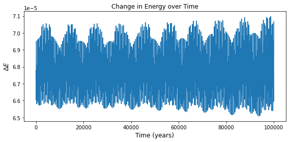
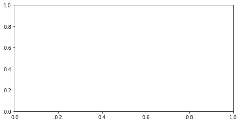

    ---------------------------------------------------------------------------

    ValueError                                Traceback (most recent call last)

    <ipython-input-41-38fa964b896d> in <module>
          1 fig, ax = plt.subplots(figsize=(8,4))
    ----> 2 plt.plot(df_n[' t'], resang)
          3 plt.xlabel('Time (years)', fontsize=12)
          4 plt.ylabel('$\Delta \phi$', fontsize=12)
          5 plt.title('Change in Resonance Angle over Time', fontsize=12)

    /opt/anaconda3/lib/python3.8/site-packages/matplotlib/pyplot.py in plot(scalex, scaley, data, *args, **kwargs)
       2759 @docstring.copy(Axes.plot)
       2760 def plot(*args, scalex=True, scaley=True, data=None, **kwargs):
    -> 2761     return gca().plot(
       2762         *args, scalex=scalex, scaley=scaley, **({"data": data} if data
       2763         is not None else {}), **kwargs)

    /opt/anaconda3/lib/python3.8/site-packages/matplotlib/axes/_axes.py in plot(self, scalex, scaley, data, *args, **kwargs)
       1645         """
       1646         kwargs = cbook.normalize_kwargs(kwargs, mlines.Line2D)
    -> 1647         lines = [*self._get_lines(*args, data=data, **kwargs)]
       1648         for line in lines:
       1649             self.add_line(line)

    /opt/anaconda3/lib/python3.8/site-packages/matplotlib/axes/_base.py in __call__(self, *args, **kwargs)
        214                 this += args[0],
        215                 args = args[1:]
    --> 216             yield from self._plot_args(this, kwargs)
        217 
        218     def get_next_color(self):

    /opt/anaconda3/lib/python3.8/site-packages/matplotlib/axes/_base.py in _plot_args(self, tup, kwargs)
        340 
        341         if x.shape[0] != y.shape[0]:
    --> 342             raise ValueError(f"x and y must have same first dimension, but "
        343                              f"have shapes {x.shape} and {y.shape}")
        344         if x.ndim > 2 or y.ndim > 2:

    ValueError: x and y must have same first dimension, but have shapes (1001,) and (0,)

